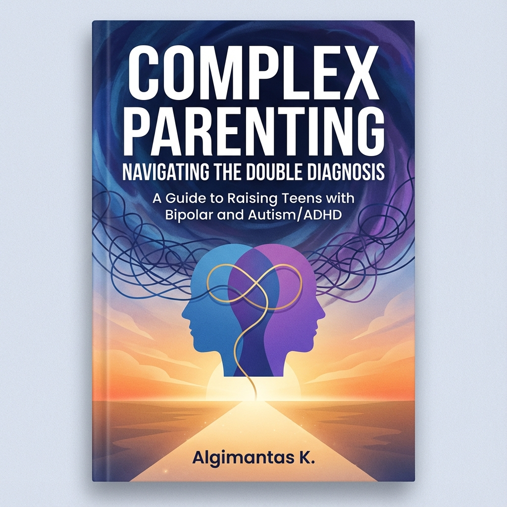

# Complex Parenting: Navigating the "Double Diagnosis"
## A Guide to Raising Teens with Bipolar and Autism/ADHD



[](https://algiras.github.io/complex-parenting/)
[](https://github.com/Algiras/complex-parenting/releases)

**Author:** Algimantas K.

This repository contains the source code and content for the book *Complex Parenting*, a comprehensive guide for parents navigating the intersection of Bipolar Disorder and Autism/ADHD in teens.

## 📖 About the Book

Raising a teen with a "Double Diagnosis" of Bipolar Disorder and Autism (or ADHD) presents unique challenges that standard parenting advice often fails to address. This book provides a unified framework for stability, synthesizing research from clinical neuroscience, family systems theory, and lived experience.

**Key Themes:**
- **The Comorbidity Gap:** Why these conditions are treated in silos and how to bridge them.
- **The Family Mobile:** Viewing the family as an interconnected system.
- **Sleep is Medicine:** The critical role of circadian rhythms.
- **Managing the Rage:** Protocols for de-escalating meltdowns and manic episodes.

## 🚀 Getting Started

### Prerequisites
- [Quarto](https://quarto.org/)
- Python 3.11+
- TinyTeX (for PDF rendering)

### Build the Book locally

1.  **Install Dependencies:**
    ```bash
    pip install -e .
    ```

2.  **Render All Formats (HTML, PDF, EPUB):**
    ```bash
    quarto render
    ```

### Setup

1. **Install Python dependencies**:
   ```bash
   pip install -e .
   pip install -r audiobook/requirements.txt
   ```

2. **Generate Audiobook (Local - Free & Fast)**:
   This uses the **Kokoro** model, which runs locally on your Mac (optimized for Apple Silicon).
   ```bash
   python audiobook/scripts/generate_local_kokoro.py
   ```
   *   First run will download model files (~300MB).
   *   Audio files are saved to `audiobook_output/`.

3. **Generate Audiobook (ElevenLabs API)**:
   ```bash
   cp .env.example .env
   # Edit .env and add your ELEVENLABS_API_KEY
   generate-audiobook
   ```

    Output files will be generated in the `_output/` directory.

## 🔄 CI/CD & Publishing

This project uses GitHub Actions to automatically build and publish the book.

- **On Push to `main`:**
    - Renders HTML, PDF, and EPUB.
    - Deploys the HTML version to [GitHub Pages](https://algiras.github.io/complex-parenting/).
    - PDF and EPUB files are available for download from the website.

- **Releases:**
    - Triggering a release workflow creates a GitHub Release with the PDF and EPUB assets attached.

## 📂 Project Structure

```
├── _quarto.yml              # Book configuration & metadata
├── index.qmd                # Home page / Introduction
├── chapters/                # Content chapters (.qmd files)
├── cover.png                # Book cover image
├── styles.css               # Custom styling
├── .github/workflows/       # CI/CD pipelines
└── README.md                # This file
```

## ☕ Support the Work

This project is an open-source labor of love. If this book helps you or your family, please consider supporting its continued development:

[](https://www.buymeacoffee.com/Algiras)

## 📄 License

This work is licensed under a **Creative Commons Attribution-NonCommercial-ShareAlike 4.0 International License** (CC BY-NC-SA 4.0).

You are free to:
- **Share** — copy and redistribute the material in any medium or format.
- **Adapt** — remix, transform, and build upon the material.

Under the following terms:
- **Attribution** — You must give appropriate credit, provide a link to the license, and indicate if changes were made.
- **NonCommercial** — You may not use the material for commercial purposes.
- **ShareAlike** — If you remix, transform, or build upon the material, you must distribute your contributions under the same license as the original.
